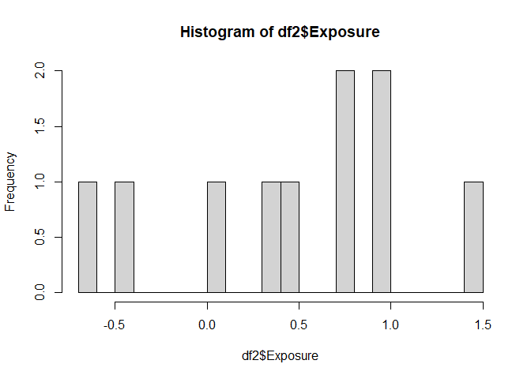
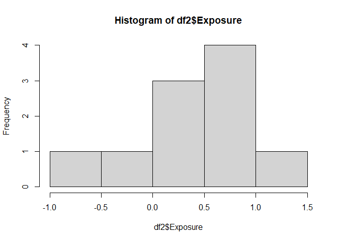
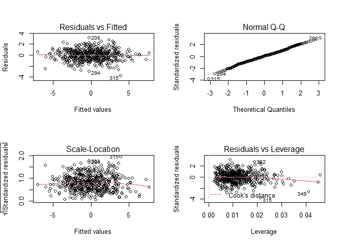
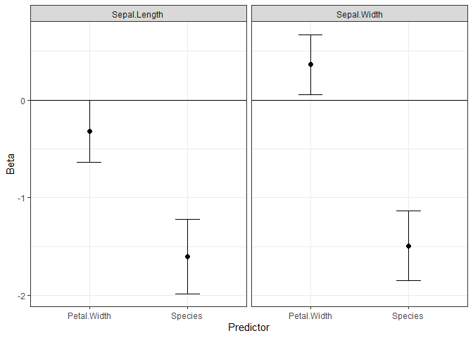

Introduction to R
================
Drew Day
2023-05-19


- [Introduction](#introduction)
- [R Interface](#r-interface)
- [Assigning Variables](#assigning-variables)
- [Operators](#operators)
- [Functions](#functions)
- [Data Classes](#data-classes)
  - [Vectors](#vectors)
  - [Matrices](#matrices)
  - [Arrays](#arrays)
  - [Lists](#lists)
  - [Data Frames](#data-frames)
- [Making Functions](#making-functions)
- [If Else statements](#if-else-statements)
- [For loops](#for-loops)
- [Apply](#apply)
- [Combining Concepts - Looped
  Functions](#combining-concepts---looped-functions)

<style type="text/css">
  body{
  font-size: 13pt;
}
code.r{
  font-size: 14px;
}
pre {
  font-size: 14px
}
.section h2 {
  font-size: 40px;
  margin-top: 2em !important;
  margin-bottom: 0.75em;
}
.section h3 { 
  font-size: 30px;
  padding-top: 1.25em !important;
  margin-bottom: 0.75em;
}
.tocify {
  font-size: 20px;
}
</style>

## Introduction

This document is a guide to understanding some basic features of R.
There are other, more official guides you can also refer to, such as the
Comprehensive R Archive Network (CRAN) [official R
manual](https://cran.r-project.org/doc/manuals/r-release/R-intro.pdf).
Another great resource similar to this is the guide by Sarah Bonnin
called [Introduction to R
2021](https://biocorecrg.github.io/CRG_RIntroduction/index.html).

R is a programming language that deals with assigning variables,
creating functions to manipulate those variables, organizing and
manipulating data, creating visualizations and even web applications,
and many more tools. We’ll go through these systematically to give you a
sense of how to use R.

This html document you’re reading was created entirely within R using a
package (i.e., a saved set of functions, sometimes with example data as
well) called ‘rmarkdown’. These Markdown documents can be in many forms,
such as presentation slides or documents like this one, and they can
combine several different types of code; such as R, CSS, YAML, etc.; to
make a fancy web page-like format for presenting data. We’ll get into
that later, though.

## R Interface

First, let’s explore the RStudio interface as shown
[below](https://biocorecrg.github.io/CRG_RIntroduction/rstudio-interface.html).
There are generally four windows open that you can rearrange however you
like. When you open base R, the interface is much simpler and only
includes one or two windows.

<center>

</center>

We’ll start with the first window that pops up in base R, the console
(bottom left in the image above). The console prints out output and can
also accept code one line at a time that you can run by pressing ‘Enter’
on your keyboard. This is a place to view and run temporary code and
output, as none of the code or output printed to the console is saved
(except some of the most recent history of the lines of code you run
here is saved in an .Rhistory file). You can cycle through previous
lines of code you ran by pressing the up and down directional keys on
your keyboard.

Another important window is the window containing your scripts (top left
in the image above). Different from the console, this window contains
code that you want to save, stored in scripts with many lines of code as
.R files. No output is shown in this window (with the exception of
Markdown files, but that’ll come later). You can run lines of code here
using Ctrl+Enter, which either runs only the line of code your cursor is
on (always true in base R), runs all associated lines of code if your
cursor is on a multi-line call (e.g., a function that takes up many
lines), or runs all pieces of code you’ve highlighted, which can be just
a part of a line or many lines.

In RStudio, there’s also a window that shows your environment, which is
where all variables you make are stored. In base R you don’t have this
window, but you can print out all variables in your current environment
by running the code `ls()`. The objects in this environment can be saved
one at a time in .Rda or .RData files, and the entire environment can
also be saved as a .RData file.

Finally, there is a general purpose window that shows files, plots, help
manual pages, your currently downloaded/loaded packages, and a viewer
for interactive plots/tables. When starting, we’ll mostly use this for
the help tab. You can look up any help manual page for any function by
either searching for it in the search bar in this tab or running the
code `?` before the name of a function (e.g., `?mean`).

## Assigning Variables

R and other similar languages like Python are [object-oriented
programming](https://en.wikipedia.org/wiki/Object-oriented_programming)
languages. This means that this language is designed around data stored
as objects rather than designed around functions and logic. Let’s start
by understanding how to assign basic variables. You can assign variables
using an arrow (‘\<-’ or ‘-\>’) or ‘=’. The former two are more specific
and are the norm, especially the left arrow. The reason you want to use
this rather than the equals sign is that you may have two variable names
you’ve set, and if you set `variable1 = variable2`, it’s unclear which
one should be replaced with the other, at least for others reading your
code, though in reality in this case `variable1` would take on the value
of `variable2`. Convention is to put the variable name on the left and
what is being assigned to it on the right.

Below I set several numbers to be various variable names. Note that
variable names can be anything as long as they don’t start with a
number, contain spaces, or have certain characters (’\_’ is fine, but
most other characters are not). For example, assigning a variable to
`2var` won’t work since it starts with a number, but `var2` does work.
If you must deal with variables with spaces or other unacceptable
characters in the variable name, you can do that by wrapping the name of
the variable in \`\`.

Note that I add notes to my code for reference using ‘\#’, which
silences all code after it in a given line. You can highlight lines of
code you want to silence and press Ctrl+Shift+C in RStudio to “comment
out” those lines or to reverse that. Note also that spaces don’t really
matter for most types of R codes.

``` r
a<-5
8 -> pizza #right arrows are harder to read and are discouraged
var2    = 35.67

pizza_pie <- "this is a string"

#Doesn't work:
# 35.67 = var2 
# 2var <- 35.67

#You can coerce variable names with otherwise unacceptable characters using ``
`2 var` <- 8
`3$&@#` <- "seriously don't assign a variable like this even though you can"
```

## Operators

Operators perform mathematical manipulations of your objects. A good
list can be found [at this
link](https://intellipaat.com/blog/tutorial/r-programming/operators/?US).

First, let’s go over basic mathematical operators using the following
code:

``` r
18-3.45
```

    ## [1] 14.55

``` r
2*3
```

    ## [1] 6

``` r
a/pizza
```

    ## [1] 0.625

``` r
2**3 #exponentiation
```

    ## [1] 8

``` r
3%%2 #remainder after division
```

    ## [1] 1

``` r
#You can't apply math operators to strings (also called "characters")
#Doesn't work: 
# pizza_pie/4 #Note the error message that pops up when you run this
```

Other operators are logical in nature, leading to TRUE or FALSE output.
These are demonstrated below:

``` r
a >= pizza #greater than or equal to
```

    ## [1] FALSE

``` r
14 == 15 #equal to
```

    ## [1] FALSE

``` r
14!=15 #not equal to
```

    ## [1] TRUE

``` r
7%in%6:8 #is the left object within the vector on the right of '%in%'
```

    ## [1] TRUE

``` r
!10 %in% 1:3 #opposite of within (i.e., "not in") 
```

    ## [1] TRUE

## Functions

Functions are central to programming in R. They are an object defined in
the code that defines input called arguments, manipulates that input,
and then returns output. Every R function in base R and available
through official package repositories like CRAN has a manual page that
can be seen as mentioned before using `?` or searching in the help tab.

All functions are of the format `function_name(arguments)`. Every time
you use parentheses in R, it’s because you’re defining function
inputs/arguments. If you want to know what the arguments are for a given
function, you can run `args(function_name)` to print them out, or you
can just read about them in the help page.

One of the simplest functions is used to concatenate (i.e., join
together) individual values into a vector using the function `c`. In the
example below, I join the numbers assigned to variables earlier. A
vector in linear algebra is simply a quantity that cannot be expressed
with a scalar (i.e., one number) and is both ordered and of a single
dimension. We can think of this as a single column in a matrix (e.g., a
list of ages for participants in a study).

``` r
vector1 <- c() #assigns an empty vector

vector2 <- c(a, pizza)
vector2
```

    ## [1] 5 8

``` r
vector3 <- 6:10 # the single colon in R defines an adjacent integer sequence, here 6, 7, 8, 9, & 10

vector4 <- c(6:10,35,5:-2) # the colon can be used in a forward or backward direction
vector4
```

    ##  [1]  6  7  8  9 10 35  5  4  3  2  1  0 -1 -2

Another more programmatic way to assign variables is using a function
called `assign`.

``` r
assign("vector3",6:10)
vector3
```

    ## [1]  6  7  8  9 10

If you enter the arguments in the order that they are defined in the
function, you don’t need to name them specifically using
`argument1 = ...`, but if you go out of order for any reason, you do
need to name the argument. For example, the arguments for the function
to make a sequence of numbers `seq` are as follows:
`from = 1, to = 1, by = ((to - from)/(length.out - 1)), length.out = NULL, along.with = NULL, ...`.
If you input the order seq(from, to, by) (e.g., `seq(0,2,0.2)`), you
don’t need to specify `from = x`, etc., but you do need to specify
`length.out = x` (spaces are optional) if you skip the `by=` argument
that is superceded when length.out is anything other than NULL.

``` r
vector5 <- seq(to=6.5,from=1.5,by=0.5)
vector5 <- seq(1.5,6.5,0.5) #this is the same as above
vector5 <- seq(1.5,6.5,length.out=10) #have to specify the length.out since it's out of order
vector5 #Here I replace vector5 with a sequence with 10 evenly spaced values between 1.5 and 6.5
```

    ##  [1] 1.500000 2.055556 2.611111 3.166667 3.722222 4.277778 4.833333 5.388889
    ##  [9] 5.944444 6.500000

``` r
# rep is another function that repeats values
rep(c(2,4),2)
```

    ## [1] 2 4 2 4

``` r
rep(c(2,4),each=2)
```

    ## [1] 2 2 4 4

## Data Classes

### Vectors

#### Numeric

Data exists in many types of data classes in R, which affect the
behavior of each object. The function `class(object)` will tell you the
data class of a given object. First we will go over various vector
objects. The first is “numeric” for continuous values, which in other
languages is sometimes called a “float” since the numeric value is
represented using a [floating
number](https://en.wikipedia.org/wiki/Floating-point_arithmetic). Like
other computer languages, R uses the [float64
format](https://en.wikipedia.org/wiki/Double-precision_floating-point_format)
(for 64 bits of data) that is accurate up to the 10<sup>-16</sup> place.

``` r
vec1<-c()
#this creates an empty vector

#numeric - continuous values
set.seed(15) #set.seed sets a seed for a random process to make it reproducible
#put any integer as the seed; here I randomly chose 15

vec1<-rnorm(20,0.5,2) #draws 20 random Normally distributed values with mean=0.5 and SD=2
class(vec1)
```

    ## [1] "numeric"

``` r
vec1
```

    ##  [1]  1.0176457  4.1622414 -0.1792371  2.2943963  1.4760326 -2.0107716
    ##  [7]  0.5455764  2.6815464  0.2357551 -1.6500026  2.2100215 -0.2299603
    ## [13]  0.8311086 -1.9855700  3.4185754  0.4927745  0.4582337  0.5642120
    ## [19] -1.8345560 -0.5391432

``` r
length(vec1)
```

    ## [1] 20

``` r
# side note: Rounding of numeric vectors:
round(vec1,2) #rounds to hundredths
```

    ##  [1]  1.02  4.16 -0.18  2.29  1.48 -2.01  0.55  2.68  0.24 -1.65  2.21 -0.23
    ## [13]  0.83 -1.99  3.42  0.49  0.46  0.56 -1.83 -0.54

``` r
signif(vec1,2) #keeps 2 significant figures
```

    ##  [1]  1.00  4.20 -0.18  2.30  1.50 -2.00  0.55  2.70  0.24 -1.70  2.20 -0.23
    ## [13]  0.83 -2.00  3.40  0.49  0.46  0.56 -1.80 -0.54

``` r
#to how many decimal places is the numeric class accurate?
formatC(1/3,16)
```

    ## [1] "0.3333333333333333"

``` r
formatC(1/3,20) #noise after 16 decimal places
```

    ## [1] "0.33333333333333331483"

#### Integer

The next vector class is “integer” for integers and counts. We can
create new objects with a given class by calling the function with that
class name (e.g., `numeric(2)` gives a vector of zeros of length 2), and
we can coerce existing objects to have a certain class using the ‘as.x’
functions (e.g., `as.numeric`, `as.integer`, etc.).

``` r
#integer - integers/counts
vec2<-as.integer(vec1) #as.X coerces one class into another
class(vec2)
```

    ## [1] "integer"

``` r
vec2
```

    ##  [1]  1  4  0  2  1 -2  0  2  0 -1  2  0  0 -1  3  0  0  0 -1  0

``` r
#here I coerce (i.e., force) the continuous "numeric" class into an "integer" class,
#  so every value is rounded to its nearest integer

#Data sampled from a Poisson or negative binomial distribution (both used to model counts) have the "integer" class
class(rpois(10,2))
```

    ## [1] "integer"

#### Logical

Next is the “logical” class for TRUE/FALSE statements. In other
languages, these vectors are sometimes called booleans. In R, true is
represented with `TRUE` or `T` and false with `FALSE` or `F`.

``` r
#logical - TRUE/FALSE (also called a 'boolean')
boolean1 <- vec1<0
class(boolean1)
```

    ## [1] "logical"

``` r
boolean1
```

    ##  [1] FALSE FALSE  TRUE FALSE FALSE  TRUE FALSE FALSE FALSE  TRUE FALSE  TRUE
    ## [13] FALSE  TRUE FALSE FALSE FALSE FALSE  TRUE  TRUE

``` r
which(boolean1) #returns the indices (i.e., positions) of the TRUE elements
```

    ## [1]  3  6 10 12 14 19 20

``` r
which(vec1> -1 & vec1<1) #AND logical statement
```

    ## [1]  3  7  9 12 13 16 17 18 20

``` r
which(vec1> -1 | vec1<1) #OR logical statement
```

    ##  [1]  1  2  3  4  5  6  7  8  9 10 11 12 13 14 15 16 17 18 19 20

#### Character

Strings and other non-numeric and non-logical (T/F) characters can be
stored in a vector with a class called “character”. This class has no
ordering or numeric value assigned to any of the unique characters.
Using `paste`

``` r
#character - 'strings', i.e., non-numeric characters
vec2 <- as.character(vec1)
vec2 <- paste0(round(vec1,1),"%") #paste0 pastes characters together without a separator
class(vec2)
```

    ## [1] "character"

``` r
vec2
```

    ##  [1] "1%"    "4.2%"  "-0.2%" "2.3%"  "1.5%"  "-2%"   "0.5%"  "2.7%"  "0.2%" 
    ## [10] "-1.7%" "2.2%"  "-0.2%" "0.8%"  "-2%"   "3.4%"  "0.5%"  "0.5%"  "0.6%" 
    ## [19] "-1.8%" "-0.5%"

#### Factor

``` r
#factor - ordered strings with levels, used for unordered and ordinal strings even though
#  there's a rarely used "ordinal" class too
vec2<-as.factor(c("pizza","pie","ice cream")) #default factor level is alphanumerically ordered
class(vec2)
```

    ## [1] "factor"

``` r
vec2
```

    ## [1] pizza     pie       ice cream
    ## Levels: ice cream pie pizza

``` r
levels(vec2)
```

    ## [1] "ice cream" "pie"       "pizza"

``` r
summary(vec2) #summary is a broad function to summarize any R object
```

    ## ice cream       pie     pizza 
    ##         1         1         1

``` r
vec2<-factor(vec2,levels=c("pizza","pie","ice cream")) #reorder factor levels
summary(vec2)
```

    ##     pizza       pie ice cream 
    ##         1         1         1

``` r
levels(vec2)<-paste0("NewName",1:3) #rename factor levels without reordering them
summary(vec2) #see also: table(vec2)
```

    ## NewName1 NewName2 NewName3 
    ##        1        1        1

``` r
as.numeric(vec2) #shows how the factor is numerically encoded
```

    ## [1] 1 2 3

#### Date

``` r
#Date - dates
date1<-as.Date(c("2002-01-03","1994-12-24")) #default format; time zone defaults to your computer's
date1<-as.Date(c("01/03/2022","12/24/1994"),format="%m/%d/%Y") #same as above
class(date1)
```

    ## [1] "Date"

``` r
date1
```

    ## [1] "2022-01-03" "1994-12-24"

``` r
diff(date1) #default is units="days"
```

    ## Time difference of -9872 days

``` r
#use the package 'lubridate' for more time-related functions
```

#### POSIXt

``` r
#POSIXct and POSIXlt - date-times stored as a single scalar or a list, respectively
date1<-as.POSIXct(c("2001-01-01 15:00:00","2022-08-07 14:00:00")) #default format
class(date1)
```

    ## [1] "POSIXct" "POSIXt"

``` r
date1
```

    ## [1] "2001-01-01 15:00:00 PST" "2022-08-07 14:00:00 PDT"

``` r
date1<-as.POSIXlt(date1)
class(date1)
```

    ## [1] "POSIXlt" "POSIXt"

``` r
date1$hour
```

    ## [1] 15 14

### Matrices

Multiple vectors of equal length can be placed together as separate
columns in a matrix. Matrices can have individual strings assigned to
name rows and columns with `rownames(matrix1)` and `colnames(matrix1)`,
respectively. Alternatively, `dimnames(matrix1)` will print out a list
of the rownames and colnames, and we’ll get into what a list is later.
You’ll often want to use the matrix class for performing mathematical
operations, such as matrix multiplication. Certain functions also
require datasets organized into columns and rows to be in matrix format.

``` r
matrix1 <- matrix(1:6,2,3,byrow=T)
matrix1
```

    ##      [,1] [,2] [,3]
    ## [1,]    1    2    3
    ## [2,]    4    5    6

``` r
colnames(matrix1) <- paste("C",1:3,sep="")
rownames(matrix1) <- paste0("R",1:2)
matrix1
```

    ##    C1 C2 C3
    ## R1  1  2  3
    ## R2  4  5  6

``` r
colnames(matrix1)
```

    ## [1] "C1" "C2" "C3"

``` r
dimnames(matrix1)
```

    ## [[1]]
    ## [1] "R1" "R2"
    ## 
    ## [[2]]
    ## [1] "C1" "C2" "C3"

``` r
dim(matrix1)
```

    ## [1] 2 3

### Arrays

If you want to have higher dimensional arrays than 1-D (vectors) or 2-D
(matrices), you’ll want to use the array class. You could technically
use that for the 1- and 2-D cases, but that’s rarely useful. The example
below creates a 3-D array of dimensions 2, 4, 2.

``` r
array(1:2,c(2,4,2))
```

    ## , , 1
    ## 
    ##      [,1] [,2] [,3] [,4]
    ## [1,]    1    1    1    1
    ## [2,]    2    2    2    2
    ## 
    ## , , 2
    ## 
    ##      [,1] [,2] [,3] [,4]
    ## [1,]    1    1    1    1
    ## [2,]    2    2    2    2

### Lists

Lists are general purpose ways of storing varied classes of object all
in the same place. You can have lists that include nested lists and
include everything from scalars to plots to functions to interactive
plots to data frames to entire models (e.g., all the output of a linear
regression), which themselves are often lists of lists. Lists can have
names for each of their elements, which are assigned and referred to
using the function `names`. Lists are unique in that they use the ‘\$’
to call out each of their named elements.

``` r
l1<-list(Scalar=10,Vector=seq(-10,10,length.out=4),Matrix=matrix(1:9,3,3))
class(l1)
```

    ## [1] "list"

``` r
class(l1$Vector)
```

    ## [1] "numeric"

``` r
l1
```

    ## $Scalar
    ## [1] 10
    ## 
    ## $Vector
    ## [1] -10.000000  -3.333333   3.333333  10.000000
    ## 
    ## $Matrix
    ##      [,1] [,2] [,3]
    ## [1,]    1    4    7
    ## [2,]    2    5    8
    ## [3,]    3    6    9

### Data Frames

Data frames are like matrices, except they are really stored as lists of
columns. This means they have rownames and colnames like a matrix, but
they are lists as well, so they also have names for each column stored
in names.

``` r
df1 <- as.data.frame(matrix1)
df1
```

    ##    C1 C2 C3
    ## R1  1  2  3
    ## R2  4  5  6

``` r
df2 <- data.frame(x=rnorm(10),y=letters[1:10])
df2
```

    ##               x y
    ## 1   0.430819171 a
    ## 2   0.733928361 b
    ## 3  -0.680674874 c
    ## 4   0.326196338 d
    ## 5   0.907029629 e
    ## 6  -0.462681535 f
    ## 7   0.004700029 g
    ## 8   1.450397255 h
    ## 9   0.752679093 i
    ## 10  0.966159790 j

``` r
names(df2)
```

    ## [1] "x" "y"

``` r
names(df2)<-c("Exposure","Outcome")
head(df2)
```

    ##     Exposure Outcome
    ## 1  0.4308192       a
    ## 2  0.7339284       b
    ## 3 -0.6806749       c
    ## 4  0.3261963       d
    ## 5  0.9070296       e
    ## 6 -0.4626815       f

``` r
tail(df2)
```

    ##        Exposure Outcome
    ## 5   0.907029629       e
    ## 6  -0.462681535       f
    ## 7   0.004700029       g
    ## 8   1.450397255       h
    ## 9   0.752679093       i
    ## 10  0.966159790       j

``` r
summary(df2)
```

    ##     Exposure          Outcome         
    ##  Min.   :-0.68067   Length:10         
    ##  1st Qu.: 0.08507   Class :character  
    ##  Median : 0.58237   Mode  :character  
    ##  Mean   : 0.44286                     
    ##  3rd Qu.: 0.86844                     
    ##  Max.   : 1.45040

``` r
#let's store things related to the data frame in another list
l1 <- list()
l1[[1]]<-df2
l1[[2]]<-hist(df2$Exposure, breaks=20)
```



``` r
names(l1)<-c("DataFrame","Histogram")

#Can make lists like below too:
l1 <- list(DataFrame=df2,Histogram=hist(df2$Exposure))
```



``` r
l1$DataFrame
```

    ##        Exposure Outcome
    ## 1   0.430819171       a
    ## 2   0.733928361       b
    ## 3  -0.680674874       c
    ## 4   0.326196338       d
    ## 5   0.907029629       e
    ## 6  -0.462681535       f
    ## 7   0.004700029       g
    ## 8   1.450397255       h
    ## 9   0.752679093       i
    ## 10  0.966159790       j

## Making Functions

R programmers tend to do most of their coding in the form of custom
functions set up to perform all the tasks they want to do. Assigning a
new function always take the format of
`function_name <- function(arguments){body}`. Curly brackets ‘{}’
evaluate multiple “expressions” (i.e., lines of code) at once and only
return the output of the last line of code. They are used to denote the
body of a function, for/while loop, if/else statement, etc., but they
are not necessary if the body of any of those is just one line since
that’s just one expression. The arguments are your inputs, and then in
the body you do something with those inputs and then specify an output.
The output can be returned by specifying `return(your_output)` on the
last line of the function, which will cause the function to end and
return whatever object is in the parentheses. No code in the body of the
function after `return` will run. Also, output can be returned just by
having the last line of the body of the function be some call that leads
to some output (e.g., having the last line be `x*y` or `plot(results)`).

You can set default values for arguments so that you don’t always have
to specify each argument. For example, if your function is
`ex1 <- function(x,y=pi) x**y`, then if I don’t specify y, it will
default to pi.

When functions run, they actually create a temporary internal
environment that brings in objects you’ve already defined in your main
environment and then evaluate the arguments and any internally defined
objects. Once the function is finished, it runs the output, but all
other variables defined in the arguments or within the body of the
function disappear.

``` r
#format for making functions:
# function_name <- function(arguments) body

standev <- function(x) sqrt(var(x))

#set seed of a random process to make it reproducible
set.seed(14)
ages <- rnorm(500,30,sd=3)
# hist(ages,breaks=50)
standev(ages)
```

    ## [1] 3.120192

``` r
sd(ages) #here's the base R function that performs standard deviations. Note how the output is the same as our standev function.
```

    ## [1] 3.120192

``` r
nalen<- function(x) length(which(is.na(x)))
ex1 <-c(1,2,NA,-1,0,NA)
nalen(ex1)
```

    ## [1] 2

``` r
is.na(ex1) 
```

    ## [1] FALSE FALSE  TRUE FALSE FALSE  TRUE

``` r
which(is.na(ex1)) #gives index values of boolean
```

    ## [1] 3 6

``` r
length(ex1)
```

    ## [1] 6

``` r
length(which(!is.na(ex1)))
```

    ## [1] 4

``` r
length(is.na(ex1))
```

    ## [1] 6

``` r
nalen <- function(vec1, wantnacount=T){
  if(wantnacount){
    output<- length(which(is.na(ex1)))
  } else {
    output <- length(which(!is.na(ex1)))
  }
  return(output)
}
nalen(ex1,F)
```

    ## [1] 4

``` r
df3<-mvtnorm::rmvnorm(500,rep(0,5)) 
#this creates a random multivariate Normal distribution of 5 variables with means of 0 and 0 covariance

df3<-as.data.frame(df3)
names(df3)<-paste0("x",1:5)

df3$yhat<- as.matrix(df3[,grep("x",names(df3))]) %*% c(-2,0.2,0,0,1)
df3$y <- df3$yhat + rnorm(nrow(df3))

fancy<-function(formula,Data){
  lm1<-lm(formula,Data)
  coef<-summary(lm1)$coef
  return(list(Coef=coef,Model=lm1))
}

form1<-formula(paste0("y~",paste(paste0("x",1:5),collapse="+")))
f1<-fancy(form1,df3)
names(f1)
```

    ## [1] "Coef"  "Model"

``` r
par(mfrow=c(2,2))
plot(f1$Model)
```



``` r
par(mfrow=c(1,1))
# View(f1$Coef)
```

## If Else statements

If else statements define what happens conditionally. They are of the
form if(logical_statement){body1} else {body2}. In this form, you can
only evaluate one logical statement at a time (this includes linking
several together with AND or OR logic). If you need to create
conditional actions over a vector, use `ifelse()`.

``` r
arg1<-"option_a"
if(arg1=="option_b"){
  print("arg1 is option_b")
} else if(grepl("a",arg1)){ #grepl is the logical form of grep, which searches for patterns (the latter returns indices)
  print(paste0("arg1 is option_",substr(arg1,nchar(arg1),nchar(arg1))))
} else {
  print("arg1 is not a known option")
}
```

    ## [1] "arg1 is option_a"

``` r
set.seed(4)
testvec1<-rnorm(40)
summary(ifelse(testvec1<0,1,0)) #ifelse() is for a vector of logical expressions rather than one at a time
```

    ##    Min. 1st Qu.  Median    Mean 3rd Qu.    Max. 
    ##   0.000   0.000   0.000   0.375   1.000   1.000

## For loops

For loops perform a repetitive function over a vector of values.

``` r
mysds<-c()
for(i in 1:3){
  mysds<-c(mysds,standev(rnorm(1000,sd=i)))
}
mysds
```

    ## [1] 0.9717467 1.9915987 2.9255633

``` r
df2$z<-df2$Exposure+rnorm(nrow(df2))
apply(as.matrix(df2[,-2]),2,function(x) mean(x,na.rm=T))
```

    ##  Exposure         z 
    ## 0.4428553 0.3800478

``` r
lapply(df2[,-2],mean)
```

    ## $Exposure
    ## [1] 0.4428553
    ## 
    ## $z
    ## [1] 0.3800478

``` r
mycolmeans<-sapply(df2[,-2],mean)
names(mycolmeans)
```

    ## [1] "Exposure" "z"

## Apply

R has several `apply`-related functions that perform a function over a
vector representing one argument in that function (or multiple vectors
representing multiple arguments as implemented in `mapply`).

``` r
head(iris) #this is a classic R example dataset included in base R
```

    ##   Sepal.Length Sepal.Width Petal.Length Petal.Width Species
    ## 1          5.1         3.5          1.4         0.2  setosa
    ## 2          4.9         3.0          1.4         0.2  setosa
    ## 3          4.7         3.2          1.3         0.2  setosa
    ## 4          4.6         3.1          1.5         0.2  setosa
    ## 5          5.0         3.6          1.4         0.2  setosa
    ## 6          5.4         3.9          1.7         0.4  setosa

``` r
sapply(iris, class) #outputs vector, matrix, list or whatever seems to fit the output best
```

    ## Sepal.Length  Sepal.Width Petal.Length  Petal.Width      Species 
    ##    "numeric"    "numeric"    "numeric"    "numeric"     "factor"

``` r
lapply(iris, class) #outputs a list
```

    ## $Sepal.Length
    ## [1] "numeric"
    ## 
    ## $Sepal.Width
    ## [1] "numeric"
    ## 
    ## $Petal.Length
    ## [1] "numeric"
    ## 
    ## $Petal.Width
    ## [1] "numeric"
    ## 
    ## $Species
    ## [1] "factor"

``` r
Pearson<-function(x,y,Data){
  cort<-cor.test(Data[,x], Data[,y])
  return(list(Coef=cort$estimate, pval=cort$p.value))
}
#function comes first in mapply but second in sapply, apply, lapply, tapply, etc.
mapply(Pearson,x=names(iris)[1:2],y=names(iris)[3:4],MoreArgs=list(Data=iris))
```

    ##      Sepal.Length Sepal.Width 
    ## Coef 0.8717538    -0.3661259  
    ## pval 1.038667e-47 4.073229e-06

## Combining Concepts - Looped Functions

Below we create a simple function to iterate linear models over vectors
of outcome and predictor variables. Rather than manually calculating a
complicated nested for loop index (I’m calling this “matindex” here),
you can also just set the nrow of “outmat” as zero and repeatedly rbind
the new row to “outmat” with `outmat <- rbind(outmat, newrow)`, though
this runs a bit slower. Ultimately, apply is faster than for loops, and
for loops run faster when you create matrices, etc. to be filled ahead
of time (e.g., an empty a x b matrix rather than a 0 x b matrix you
repeatedly stick rows on the bottom of). Notice the diversity of output
you can create. Here we output a data frame summarizing our coefficients
of interest, a forest plot of those coefficients, and a list of all
linear model objects (which are lists storing all sorts of info related
to the model, including coefficients, p-values, the data used for the
model, etc.) in case we want to extract more information from them.

``` r
library(ggplot2)

multilm <- function(preds,outs,Data,covars=NULL){
  lmlist<-list() #empty list to fill
  outmat<-as.data.frame(matrix(NA,length(preds)*length(outs),7)) #empty data frame to fill with the for loop
  for(i in 1:length(outs)){
    for(j in 1:length(preds)){ #nested for loop
      matindex<-(1+(j-1))+((i-1)*length(preds)) #manually calculating the index for the nested loop
      if(is.null(covars)){
        thisform<-formula(paste0(outs[i],"~",preds[j]))
      } else {
        thisform<-formula(paste0(outs[i],"~",preds[j],"+",paste(covars,collapse="+")))
      }
      mylm<-lm(thisform,Data)
      lmlist[[paste0(outs[i],"~",preds[j])]]<-mylm
      outmat[matindex,1:2]<-c(outs[i],preds[j])
      outmat[matindex,c(3:4,7)]<-c(mylm$coef[2], summary(mylm)$coef[2,2], summary(mylm)$coef[2,4])
      outmat[matindex,5:6]<-confint(mylm)[2,]
    }
  }
  names(outmat)<-c("Outcome","Predictor","Beta","SE","LCI","UCI","p-value")
  forestplot <- ggplot(data=outmat, aes(x=Predictor,y=Beta)) + theme_bw() +
    geom_point(size=2) + geom_errorbar(aes(ymin=LCI,ymax=UCI),width=0.25) + 
    geom_hline(yintercept=0) +
    facet_wrap(~Outcome)
  #the above is ggplot-related code, which is important to learn for plotting
  outlist<-list(Results=outmat,ForestPlot=forestplot,LMlist=lmlist)
}

mlm1<-multilm(names(iris)[4:5],names(iris)[1:2],iris,names(iris)[3])
mlm1$Results
```

    ##        Outcome   Predictor       Beta        SE         LCI          UCI
    ## 1 Sepal.Length Petal.Width -0.3195506 0.1604526 -0.63664237 -0.002458754
    ## 2 Sepal.Length     Species -1.6009717 0.1934662 -1.98332773 -1.218615717
    ## 3  Sepal.Width Petal.Width  0.3640421 0.1549632  0.05779861  0.670285509
    ## 4  Sepal.Width     Species -1.4926741 0.1806175 -1.84963664 -1.135711501
    ##        p-value
    ## 1 4.827246e-02
    ## 2 7.371529e-14
    ## 3 2.014365e-02
    ## 4 7.845838e-14

``` r
mlm1$ForestPlot
```



``` r
summary(mlm1$LMlist$`Sepal.Width~Petal.Width`)
```

    ## 
    ## Call:
    ## lm(formula = thisform, data = Data)
    ## 
    ## Residuals:
    ##      Min       1Q   Median       3Q      Max 
    ## -1.06198 -0.23389  0.01982  0.20580  1.13488 
    ## 
    ## Coefficients:
    ##              Estimate Std. Error t value Pr(>|t|)    
    ## (Intercept)   3.58705    0.09373  38.272  < 2e-16 ***
    ## Petal.Width   0.36404    0.15496   2.349  0.02014 *  
    ## Petal.Length -0.25714    0.06691  -3.843  0.00018 ***
    ## ---
    ## Signif. codes:  0 '***' 0.001 '**' 0.01 '*' 0.05 '.' 0.1 ' ' 1
    ## 
    ## Residual standard error: 0.3893 on 147 degrees of freedom
    ## Multiple R-squared:  0.2131, Adjusted R-squared:  0.2024 
    ## F-statistic:  19.9 on 2 and 147 DF,  p-value: 2.238e-08
